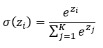
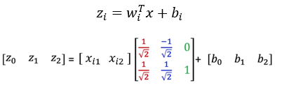

# 🧠 Module 2: Softmax

## 📖 Introduction

This module introduces the **Softmax function** and its role in extending **logistic regression** to handle **multi-class classification**.  
While logistic regression assigns probabilities to two classes using the **sigmoid** function, Softmax generalizes this principle to multiple possible outcomes. It transforms raw model outputs—known as **logits**—into a **normalized probability distribution**, ensuring that all probabilities sum to one.

The Softmax function provides a probabilistic framework that enables classification across multiple categories, with the **predicted class corresponding to the highest probability**. It also establishes the foundation for deep learning models by forming the **final activation layer** in multi-class neural networks.

---

## 🧩 Topics and Concepts

### 🔹 The Softmax Function

The Softmax function converts a vector of unnormalized logits z = [z_1, z_2, ..., z_K] into probabilities:

Each zi represents the score for class i, and the denominator normalizes these values so the total probability equals 1.  
This transformation ensures that model outputs can be **interpreted as probabilities** while preserving differentiability for **gradient-based optimization**.

Softmax is typically used in the **output layer** of neural networks, allowing the model to evaluate all classes simultaneously and quantify its confidence in each prediction.

### 🔹 Argmax Function

The **argmax** function identifies the class with the highest score or probability in a sequence of numbers.  
When combined with Softmax, it determines the **predicted class index**—that is, the class with the highest computed probability.

Together, **Softmax** and **argmax** define how neural networks produce interpretable classification outputs:

- **Softmax** provides a smooth, continuous probability distribution.
- **Argmax** converts that distribution into a discrete decision by selecting the most likely class.

### 🔹 Multi-Dimensional Generalization

Softmax extends naturally to multi-dimensional feature spaces. Each class is represented by a **weight vector** and a **bias**, producing one linear score per class.  
For an input vector x , the model computes:

The Softmax transformation converts these scores into probabilities, and **decision boundaries** form where two or more class scores are equal.

In higher-dimensional spaces, this geometric interpretation reveals how Softmax separates regions based on the **alignment between input features and class weight vectors**. The resulting class probabilities define smooth and continuous transitions across decision regions, avoiding abrupt thresholds.

### 🔹 Implementing Softmax in PyTorch

The practical implementation of Softmax in PyTorch involves structuring a model that outputs multiple class logits and applies **cross-entropy loss** for optimization.

In the documentation a classification model is trained to distinguish between hand written digits.

1. **Model Definition:**

   - Input dimension corresponds to the number of features (e.g., 28 x 28 = 784 for MNIST images).
   - Output dimension equals the number of classes (e.g., 10 digits).
   - Each class has its own weight and bias vector.

2. **Cross-Entropy Loss:**

   - Combines Softmax and log-likelihood into a single differentiable loss function.
   - Automatically applies Softmax to logits, eliminating the need to define it explicitly in the model.

3. **Optimization:**

   - Parameters are trained using **Stochastic Gradient Descent (SGD)**.
   - The model learns by minimizing classification error over multiple epochs through **backpropagation**.

4. **Accuracy Evaluation:**
   - Predictions are obtained using `torch.argmax()` to select the class with the highest predicted probability.
   - Accuracy is calculated by comparing predicted and true labels over validation data.

### 🔹 Representation Learning

During training, each **weight vector** evolves to represent characteristic features of a specific class.  
Initially random, these parameters gradually align with recognizable patterns that correspond to learned classes—for example, distinct shapes of handwritten digits in the MNIST dataset.

This process illustrates how neural networks learn **discriminative representations**, transforming pixel-level input data into abstract, class-specific encodings through iterative optimization.

---

## ✅ Takeaways

- **Softmax Generalization:** Extends logistic regression to multi-class problems by transforming logits into probabilities that sum to one.
- **Probabilistic Interpretation:** Produces interpretable, confidence-based outputs by normalizing logits into a probability distribution.
- **Cross-Entropy Optimization:** Uses a combined loss function that integrates Softmax and log-likelihood for stable training.
- **Gradient-Based Learning:** Parameters are refined via stochastic gradient descent, minimizing classification error through backpropagation.
- **Representation Formation:** Each weight vector learns to encode distinct class-specific features, enabling structured decision boundaries in multi-class classification.
